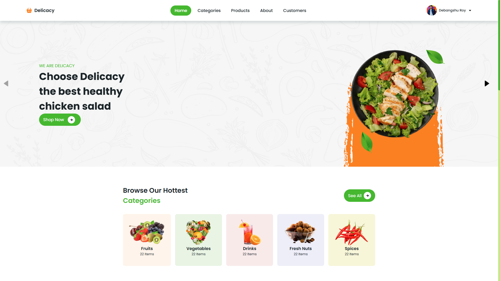
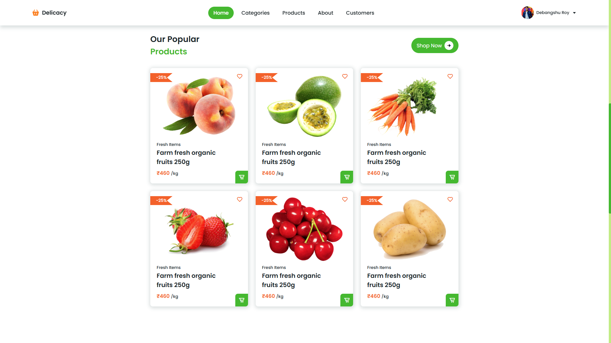
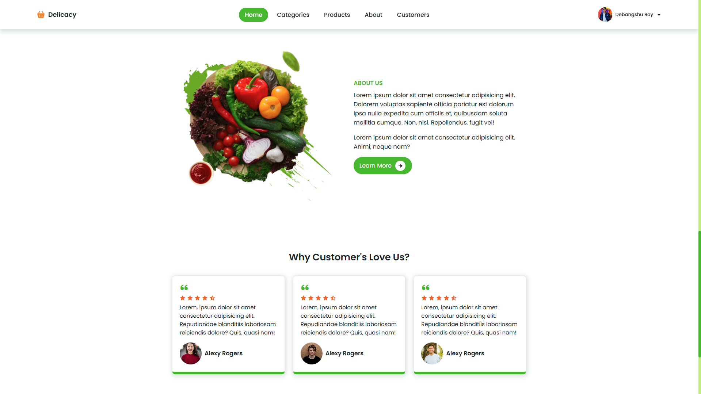

# Delicacy - Responsive Ecommerce Website

Delicacy is a fully responsive ecommerce website built using HTML, CSS, and JavaScript. This project showcases a modern design for an online food store, with a focus on aesthetics, functionality, and adaptability across devices.

## Features

- **Responsive Design**: Fully optimized for mobile, tablet, and desktop views.
- **Modern UI/UX**: Clean, visually appealing interface.
- **Dynamic Content**: Interactive elements implemented with JavaScript.
- **User-Friendly Navigation**: Intuitive and easy-to-navigate website structure.
- **Cross-Browser Compatibility**: Works seamlessly on all modern browsers.

## Live Demo

Check out the live demo of the project:

[Delicacy Ecommerce Website](https://github.com/myselfdeb/Delicacy-Ecommerce-Website)

## Technologies Used

- **HTML5**: Structuring the web content.
- **CSS3**: Styling and creating responsive layouts.
- **JavaScript**: Adding interactivity and dynamic features.

## Screenshots

### Desktop View





## Installation

Follow these steps to run the project locally:

1. Clone the repository:
   ```bash
   git clone https://github.com/myselfdeb/Delicacy-Ecommerce-Website.git
   ```

2. Navigate to the project directory:
   ```bash
   cd Delicacy-Ecommerce-Website
   ```

3. Open the `index.html` file in your preferred browser.

## Project Structure

```
Delicacy-Ecommerce-Website/
├── index.html          # Homepage of the website
├── css/                # Folder containing all CSS files
│   ├── style.css       # Main stylesheet
├── js/                 # Folder containing JavaScript files
│   ├── script.js       # Main JavaScript file
├── images/             # Folder containing all website images
└── README.md           # Documentation file
```

## Contributing

Contributions are welcome! Follow these steps to contribute:

1. Fork the repository.
2. Create a new branch:
   ```bash
   git checkout -b feature-branch
   ```
3. Make your changes and commit them:
   ```bash
   git commit -m "Add your message here"
   ```
4. Push to the branch:
   ```bash
   git push origin feature-branch
   ```
5. Open a pull request.

## License

This project is licensed under the [MIT License](LICENSE).

## Contact

If you have any questions, feel free to reach out:

- **Author**: Debangshu Roy  
- **Email**: [debangshuroy1010111@gmail.com](mailto:debangshuroy1010111@gmail.com)  
- **GitHub**: [myselfdeb](https://github.com/myselfdeb)

---

Thank you for checking out Delicacy! If you liked this project, don't forget to ⭐ star the repository.
